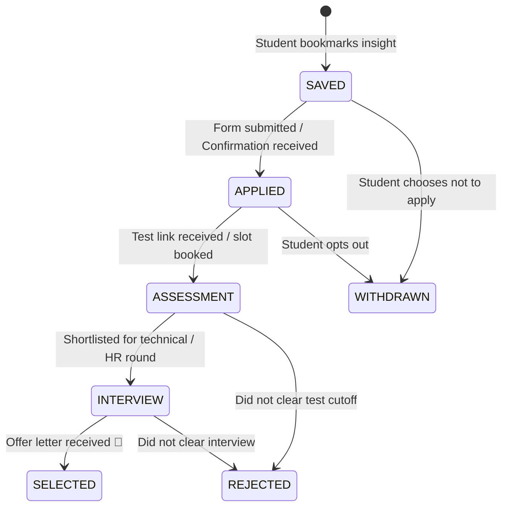

# PlaceMint AI — Business Logic & Decision Engine Specifications

> **Domain Rules & State Machine Architecture**  
> *Deterministic eligibility algorithms, deadline escalation matrices, reminder schedules, duplicate filtering, and application lifecycle states.*

---

## 1. Deterministic Student Eligibility Engine

> **Architectural Law**: Placement eligibility calculations MUST NEVER rely purely on generative AI interpretation. AI is only used to extract structured attributes into JSON. Eligibility decisions must be computed deterministically using strict mathematical and boolean comparison rules.

### 1.1 Input Parameters

| Parameter | Student Profile Value ($S$) | Extracted Opportunity Requirement ($O$) | Evaluation Rule |
| :--- | :--- | :--- | :--- |
| **Graduation Year** | $S_{year} \in \mathbb{N}$ (e.g. 2026) | $O_{years} \subseteq \mathbb{N}$ (e.g. `[2026]`) | $S_{year} \in O_{years}$ |
| **Branch / Degree** | $S_{branch} \in \text{String}$ (e.g. "CSE") | $O_{branches} \subseteq \text{String}$ (e.g. `["CSE", "IT", "ECE"]`) | Normalized branch string match or alias equivalence |
| **CGPA Cutoff** | $S_{cgpa} \in [0.0, 10.0]$ | $O_{min\_cgpa} \in [0.0, 10.0]$ | $S_{cgpa} \ge O_{min\_cgpa}$ |
| **Active Backlogs** | $S_{active\_backlogs} \in \mathbb{N}_0$ | $O_{max\_active\_backlogs} \in \mathbb{N}_0$ | $S_{active\_backlogs} \le O_{max\_active\_backlogs}$ (Default: 0) |
| **History Backlogs** | $S_{history\_backlogs} \in \mathbb{N}_0$ | $O_{max\_hist\_backlogs} \in \mathbb{N}_0$ | $S_{history\_backlogs} \le O_{max\_hist\_backlogs}$ (Default: $\infty$) |
| **10th / 12th %** | $S_{10th}, S_{12th} \in [0.0, 100.0]$ | $O_{min\_10th}, O_{min\_12th}$ | $S_{10th} \ge O_{min\_10th} \land S_{12th} \ge O_{min\_12th}$ |

### 1.2 Branch Equivalence & Alias Normalization Matrix

```json
{
  "CSE": ["Computer Science", "CSE", "CS", "Computer Science & Engineering", "CS & E"],
  "IT": ["Information Technology", "IT", "Info Tech"],
  "ECE": ["Electronics & Communication", "ECE", "Electronics and Telecommunication", "ETC"],
  "EEE": ["Electrical & Electronics", "EEE", "Electrical Engineering", "EE"],
  "MECH": ["Mechanical Engineering", "Mechanical", "ME"],
  "CIVIL": ["Civil Engineering", "CE"],
  "AIDS": ["AI & DS", "Artificial Intelligence & Data Science", "AI-ML", "AIML", "Data Science"]
}
```

### 1.3 Decision Outcome State Machine

```
                              [Start Check]
                                    |
            +-----------------------+-----------------------+
            |                                               |
  Any required field is                           All criteria explicitly
  missing or ambiguous in                         present in announcement
  extracted JSON?                                           |
            |                                  +------------+------------+
            v                                  |                         |
    [ NEEDS_REVIEW ]                 Fails any threshold?        Passes all criteria?
 (Show yellow badge +                          |                         |
  missing criteria list)                       v                         v
                                       [ NOT_ELIGIBLE ]             [ ELIGIBLE ]
                                    (Show red badge +            (Show green badge +
                                     explicit failure reason)     one-click apply)
```

---

## 2. Deadline Calculation & Urgency Escalation Matrix

### 2.1 Urgency Classification Rules

Let $T_{now}$ be the current system timestamp and $T_{deadline}$ be the opportunity closing timestamp.  
Time remaining $\Delta t = T_{deadline} - T_{now}$.

$$\text{Urgency Level} = \begin{cases} 
\text{OVERDUE} & \text{if } \Delta t \le 0 \\
\text{CRITICAL} & \text{if } 0 < \Delta t \le 6\text{ hours} \\
\text{URGENT} & \text{if } 6\text{ hours} < \Delta t \le 24\text{ hours} \\
\text{UPCOMING} & \text{if } 24\text{ hours} < \Delta t \le 7\text{ days} \\
\text{SCHEDULED} & \text{if } \Delta t > 7\text{ days}
\end{cases}$$

### 2.2 Visual Escalation Indicators

| Status | Badge Color | Pulsing Animation | Sound / Alert Action |
| :--- | :--- | :--- | :--- |
| **CRITICAL** ($\le 6\text{h}$) | `#EF4444` (Crimson) | Active 1.5s Red Glow Pulse | Immediate PWA Push Alert |
| **URGENT** ($\le 24\text{h}$) | `#F97316` (Amber Orange) | None | Notification at scheduled offset |
| **UPCOMING** ($> 24\text{h}$) | `#6366F1` (Indigo) | None | Standard Dashboard Listing |
| **COMPLETED** | `#10B981` (Emerald) | None | Strikethrough text, archived |
| **OVERDUE** | `#64748B` (Muted Slate) | None | Warning chip: "Deadline passed" |

---

## 3. Reminder Scheduling & Multi-Tier Trigger Engine

### 3.1 Offset Trigger Matrix
Each deadline automatically provisions reminder rows in the `reminders` table based on student preferences (default offsets: 24h, 6h, 1h):

$$T_{\text{remind}} = T_{\text{deadline}} - (\text{offset\_hours} \times 3600\text{ seconds})$$

- If at time of creation $T_{\text{remind}} \le T_{\text{now}}$, the reminder is flagged as `CANCELLED` (stale offset).
- If $T_{\text{remind}} > T_{\text{now}}$, the reminder is stored with `status = 'PENDING'`.

### 3.2 Reminder Cron Worker Dispatch Rule
Every 5 minutes, the web notification worker queries:
```sql
SELECT r.*, d.title, d.company_name, d.deadline_at, d.action_url, sp.fcm_token 
FROM reminders r
JOIN deadlines d ON r.deadline_id = d.id
JOIN student_preferences sp ON r.user_id = sp.user_id
WHERE r.status = 'PENDING' 
  AND r.scheduled_for <= NOW()
  AND d.status NOT IN ('COMPLETED', 'DISMISSED');
```
Once dispatched, `r.status` is updated to `'SENT'` with `sent_at = NOW()`.

---

## 4. Duplicate Message Detection & Noise Filtering

Telegram placement channels frequently circulate identical messages forwarded across multiple groups or re-posted with minor timestamp tweaks.

```
Incoming Message
      │
      ├─► Step 1: Exact Hash Deduplication (SHA-256)
      │     └─► Hash: SHA-256(lowercase(trim(message_text)))
      │     └─► If hash exists within same group in last 72 hours ──► DROP DUPLICATE
      │
      ├─► Step 2: Noise Pattern Filtering
      │     └─► Matches non-placement chatter regex (e.g. "hi sir", "add me", "link please", "good morning")
      │     └─► Message length < 25 characters with no URLs ──► MARK NOISE / SKIP AI
      │
      └─► Step 3: Structured Duplicate Clustering (Phase 2)
            └─► Normalized matching: Same Company + Same Batch + Same Registration URL
            └─► Merge into single master Opportunity with multiple Source Message references
```

---

## 5. Application Lifecycle State Machine (Phase 2)



### State Transition Validation Rules:
1. Moving to `APPLIED` requires either a valid application timestamp or automatic confirmation.
2. Moving to `ASSESSMENT` allows student to attach an assessment date, triggering test-day calendar reminders.
3. Moving to `SELECTED` prompts student to record final offer details (CTC, Base, Location) for personal placement analytics.
