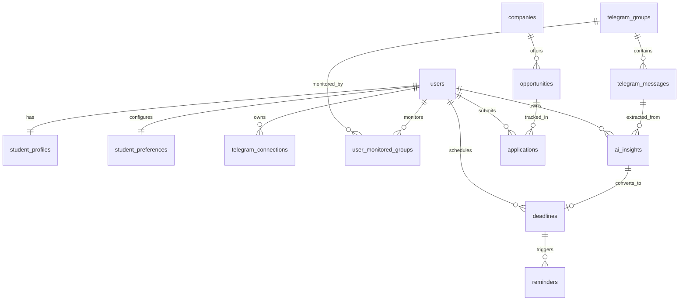

# PlaceMint AI — Supabase PostgreSQL Data Architecture & DDL Specification

> **Database Blueprint**  
> *Relational schema, foreign key relations, custom types, performance indexes, triggers, and Row-Level Security (RLS) policies.*

---

## 1. Relational Architecture Overview

The database architecture is designed with strict relational integrity, optimized for fast querying by student, group, and deadline status, while ensuring data privacy via Supabase Row-Level Security.



---

## 2. Enumerated Types (Enums)

```sql
-- Create custom enumerated types for strict domain validation
CREATE TYPE opportunity_type_enum AS ENUM (
    'JOB',
    'INTERNSHIP',
    'ASSESSMENT',
    'CODING_TEST',
    'CAMPUS_DRIVE',
    'HACKATHON',
    'WORKSHOP_TRAINING',
    'OTHER'
);

CREATE TYPE urgency_level_enum AS ENUM (
    'LOW',
    'MEDIUM',
    'HIGH',
    'CRITICAL'
);

CREATE TYPE deadline_status_enum AS ENUM (
    'UPCOMING',
    'URGENT',
    'COMPLETED',
    'OVERDUE',
    'DISMISSED'
);

CREATE TYPE reminder_status_enum AS ENUM (
    'PENDING',
    'SENT',
    'FAILED',
    'CANCELLED'
);

CREATE TYPE application_status_enum AS ENUM (
    'SAVED',
    'APPLIED',
    'ASSESSMENT',
    'INTERVIEW',
    'SELECTED',
    'REJECTED',
    'WITHDRAWN'
);

CREATE TYPE eligibility_status_enum AS ENUM (
    'ELIGIBLE',
    'NOT_ELIGIBLE',
    'NEEDS_REVIEW'
);

CREATE TYPE telegram_chat_type_enum AS ENUM (
    'CHANNEL',
    'SUPERGROUP',
    'GROUP'
);
```

---

## 3. Core Table Schemas & DDL

### 3.1 Student Profiles & Preferences

```sql
-- 1. Student Placement Profile
CREATE TABLE student_profiles (
    user_id UUID PRIMARY KEY REFERENCES auth.users(id) ON DELETE CASCADE,
    full_name TEXT NOT NULL,
    college_name TEXT,
    degree TEXT,                                  -- e.g. B.Tech, B.E., MCA
    branch TEXT,                                  -- e.g. CSE, IT, ECE
    graduation_year INT NOT NULL,                 -- e.g. 2026
    cgpa NUMERIC(4,2) CHECK (cgpa >= 0.0 AND cgpa <= 10.0),
    percentage NUMERIC(5,2),                      -- Alternative to CGPA
    active_backlogs INT DEFAULT 0 CHECK (active_backlogs >= 0),
    history_backlogs INT DEFAULT 0 CHECK (history_backlogs >= 0),
    tenth_percentage NUMERIC(5,2),
    twelfth_percentage NUMERIC(5,2),
    skills TEXT[] DEFAULT '{}',                   -- e.g. ARRAY['Java', 'Spring Boot', 'React']
    resume_url TEXT,
    created_at TIMESTAMPTZ DEFAULT NOW(),
    updated_at TIMESTAMPTZ DEFAULT NOW()
);

-- 2. Student Preferences
CREATE TABLE student_preferences (
    user_id UUID PRIMARY KEY REFERENCES auth.users(id) ON DELETE CASCADE,
    auto_run_insights BOOLEAN DEFAULT TRUE,
    auto_create_deadlines BOOLEAN DEFAULT FALSE,
    message_analysis_count INT DEFAULT 25 CHECK (message_analysis_count BETWEEN 5 AND 100),
    reminder_offsets_hours INT[] DEFAULT '{24, 6, 1}',
    push_notifications_enabled BOOLEAN DEFAULT TRUE,
    fcm_token TEXT,
    created_at TIMESTAMPTZ DEFAULT NOW(),
    updated_at TIMESTAMPTZ DEFAULT NOW()
);
```

### 3.2 Telegram Integration & Group Management

```sql
-- 3. Telegram Connections (Encrypted Session Metadata)
CREATE TABLE telegram_connections (
    id UUID PRIMARY KEY DEFAULT gen_random_uuid(),
    user_id UUID NOT NULL REFERENCES auth.users(id) ON DELETE CASCADE,
    telegram_user_id BIGINT NOT NULL,
    phone_number TEXT NOT NULL,
    username TEXT,
    first_name TEXT,
    encrypted_session_string TEXT NOT NULL,       -- AES-256-GCM encrypted Telethon session
    is_active BOOLEAN DEFAULT TRUE,
    last_synced_at TIMESTAMPTZ DEFAULT NOW(),
    created_at TIMESTAMPTZ DEFAULT NOW(),
    updated_at TIMESTAMPTZ DEFAULT NOW(),
    CONSTRAINT unique_user_telegram UNIQUE (user_id, telegram_user_id)
);

-- 4. Discovered Telegram Groups & Channels
CREATE TABLE telegram_groups (
    id UUID PRIMARY KEY DEFAULT gen_random_uuid(),
    telegram_id BIGINT NOT NULL UNIQUE,           -- Telegram MTProto Peer Channel/Chat ID
    title TEXT NOT NULL,
    username TEXT,
    chat_type telegram_chat_type_enum NOT NULL DEFAULT 'CHANNEL',
    total_members INT,
    last_message_at TIMESTAMPTZ,
    last_discovered_at TIMESTAMPTZ DEFAULT NOW(),
    created_at TIMESTAMPTZ DEFAULT NOW()
);

-- 5. User Monitored Groups Join Table
CREATE TABLE user_monitored_groups (
    id UUID PRIMARY KEY DEFAULT gen_random_uuid(),
    user_id UUID NOT NULL REFERENCES auth.users(id) ON DELETE CASCADE,
    group_id UUID NOT NULL REFERENCES telegram_groups(id) ON DELETE CASCADE,
    is_monitored BOOLEAN DEFAULT TRUE,
    auto_analyze BOOLEAN DEFAULT TRUE,
    created_at TIMESTAMPTZ DEFAULT NOW(),
    updated_at TIMESTAMPTZ DEFAULT NOW(),
    CONSTRAINT unique_user_group_monitoring UNIQUE (user_id, group_id)
);
```

### 3.3 Raw Messages & AI Insights

```sql
-- 6. Raw Ingested Telegram Messages
CREATE TABLE telegram_messages (
    id UUID PRIMARY KEY DEFAULT gen_random_uuid(),
    group_id UUID NOT NULL REFERENCES telegram_groups(id) ON DELETE CASCADE,
    telegram_message_id BIGINT NOT NULL,
    sender_id BIGINT,
    sender_name TEXT,
    message_text TEXT NOT NULL,
    media_url TEXT,
    message_timestamp TIMESTAMPTZ NOT NULL,
    message_hash CHAR(64) NOT NULL,              -- SHA-256 hash for exact deduplication
    has_links BOOLEAN DEFAULT FALSE,
    raw_payload JSONB,                            -- Extra MTProto headers
    created_at TIMESTAMPTZ DEFAULT NOW(),
    CONSTRAINT unique_group_message UNIQUE (group_id, telegram_message_id)
);

-- 7. Structured Placement Insights
CREATE TABLE ai_insights (
    id UUID PRIMARY KEY DEFAULT gen_random_uuid(),
    user_id UUID NOT NULL REFERENCES auth.users(id) ON DELETE CASCADE,
    group_id UUID NOT NULL REFERENCES telegram_groups(id) ON DELETE CASCADE,
    source_message_id UUID REFERENCES telegram_messages(id) ON DELETE SET NULL,
    company_name TEXT NOT NULL,
    role_title TEXT,
    opportunity_type opportunity_type_enum NOT NULL DEFAULT 'JOB',
    eligibility_raw TEXT,
    eligibility_criteria JSONB,                   -- { "min_cgpa": 7.0, "branches": ["CSE", "IT"], "allowed_backlogs": 0 }
    salary_or_stipend TEXT,
    batch_year TEXT,
    deadline_timestamp TIMESTAMPTZ,
    event_timestamp TIMESTAMPTZ,
    application_url TEXT,
    action_required TEXT,                         -- e.g. "Register via Google Form before 6 PM"
    urgency urgency_level_enum DEFAULT 'MEDIUM',
    confidence_score NUMERIC(3,2) CHECK (confidence_score BETWEEN 0.0 AND 1.0),
    extraction_provider TEXT DEFAULT 'GEMINI',   -- 'GEMINI' or 'RULE_FALLBACK'
    is_dismissed BOOLEAN DEFAULT FALSE,
    is_bookmarked BOOLEAN DEFAULT FALSE,
    created_at TIMESTAMPTZ DEFAULT NOW(),
    updated_at TIMESTAMPTZ DEFAULT NOW()
);
```

### 3.4 Companies, Opportunities, Deadlines & Applications

```sql
-- 8. Normalized Companies
CREATE TABLE companies (
    id UUID PRIMARY KEY DEFAULT gen_random_uuid(),
    name TEXT NOT NULL UNIQUE,
    domain TEXT,
    logo_url TEXT,
    career_portal_url TEXT,
    created_at TIMESTAMPTZ DEFAULT NOW()
);

-- 9. Normalized Placement Opportunities
CREATE TABLE opportunities (
    id UUID PRIMARY KEY DEFAULT gen_random_uuid(),
    company_id UUID REFERENCES companies(id) ON DELETE SET NULL,
    company_name TEXT NOT NULL,
    role TEXT NOT NULL,
    opportunity_type opportunity_type_enum NOT NULL,
    batch_year TEXT,
    eligibility_json JSONB,
    ctc_or_stipend TEXT,
    registration_deadline TIMESTAMPTZ,
    assessment_date TIMESTAMPTZ,
    apply_url TEXT,
    created_at TIMESTAMPTZ DEFAULT NOW()
);

-- 10. Application Lifecycle Tracker
CREATE TABLE applications (
    id UUID PRIMARY KEY DEFAULT gen_random_uuid(),
    user_id UUID NOT NULL REFERENCES auth.users(id) ON DELETE CASCADE,
    opportunity_id UUID REFERENCES opportunities(id) ON DELETE SET NULL,
    insight_id UUID REFERENCES ai_insights(id) ON DELETE SET NULL,
    company_name TEXT NOT NULL,
    role_title TEXT NOT NULL,
    status application_status_enum NOT NULL DEFAULT 'SAVED',
    applied_at TIMESTAMPTZ,
    assessment_date TIMESTAMPTZ,
    interview_date TIMESTAMPTZ,
    notes TEXT,
    created_at TIMESTAMPTZ DEFAULT NOW(),
    updated_at TIMESTAMPTZ DEFAULT NOW()
);

-- 11. Scheduled Deadlines
CREATE TABLE deadlines (
    id UUID PRIMARY KEY DEFAULT gen_random_uuid(),
    user_id UUID NOT NULL REFERENCES auth.users(id) ON DELETE CASCADE,
    insight_id UUID REFERENCES ai_insights(id) ON DELETE SET NULL,
    application_id UUID REFERENCES applications(id) ON DELETE SET NULL,
    title TEXT NOT NULL,
    company_name TEXT NOT NULL,
    deadline_at TIMESTAMPTZ NOT NULL,
    status deadline_status_enum NOT NULL DEFAULT 'UPCOMING',
    action_url TEXT,
    notes TEXT,
    created_at TIMESTAMPTZ DEFAULT NOW(),
    updated_at TIMESTAMPTZ DEFAULT NOW()
);

-- 12. Reminders Outbox & Delivery State
CREATE TABLE reminders (
    id UUID PRIMARY KEY DEFAULT gen_random_uuid(),
    user_id UUID NOT NULL REFERENCES auth.users(id) ON DELETE CASCADE,
    deadline_id UUID NOT NULL REFERENCES deadlines(id) ON DELETE CASCADE,
    scheduled_for TIMESTAMPTZ NOT NULL,
    offset_hours INT NOT NULL,                    -- 24, 6, 1
    status reminder_status_enum NOT NULL DEFAULT 'PENDING',
    sent_at TIMESTAMPTZ,
    error_message TEXT,
    created_at TIMESTAMPTZ DEFAULT NOW()
);
```

---

## 4. Performance Indexes

```sql
-- Index on monitored groups for fast union retrieval by Telegram worker
CREATE INDEX idx_monitored_groups_active ON user_monitored_groups (group_id) WHERE is_monitored = TRUE;
CREATE INDEX idx_monitored_user_lookup ON user_monitored_groups (user_id, group_id);

-- Message queries: lookup by group and recency
CREATE INDEX idx_telegram_messages_group_time ON telegram_messages (group_id, message_timestamp DESC);
CREATE INDEX idx_telegram_messages_hash ON telegram_messages (message_hash);

-- Insights queries: lookup by user, urgency and creation
CREATE INDEX idx_ai_insights_user_created ON ai_insights (user_id, created_at DESC);
CREATE INDEX idx_ai_insights_user_deadline ON ai_insights (user_id, deadline_timestamp ASC) WHERE is_dismissed = FALSE;
CREATE INDEX idx_ai_insights_company ON ai_insights (company_name);

-- Deadlines queries: fast calendar & urgent deadline filtering
CREATE INDEX idx_deadlines_user_status_date ON deadlines (user_id, status, deadline_at ASC);
CREATE INDEX idx_reminders_pending ON reminders (scheduled_for ASC) WHERE status = 'PENDING';

-- Applications queries
CREATE INDEX idx_applications_user_status ON applications (user_id, status);
```

---

## 5. Row-Level Security (RLS) Policies

All user-facing tables enforce strict isolation: students can only view and modify their own records.

```sql
-- Enable RLS on all tables
ALTER TABLE student_profiles ENABLE ROW LEVEL SECURITY;
ALTER TABLE student_preferences ENABLE ROW LEVEL SECURITY;
ALTER TABLE telegram_connections ENABLE ROW LEVEL SECURITY;
ALTER TABLE telegram_groups ENABLE ROW LEVEL SECURITY;
ALTER TABLE user_monitored_groups ENABLE ROW LEVEL SECURITY;
ALTER TABLE telegram_messages ENABLE ROW LEVEL SECURITY;
ALTER TABLE ai_insights ENABLE ROW LEVEL SECURITY;
ALTER TABLE companies ENABLE ROW LEVEL SECURITY;
ALTER TABLE opportunities ENABLE ROW LEVEL SECURITY;
ALTER TABLE applications ENABLE ROW LEVEL SECURITY;
ALTER TABLE deadlines ENABLE ROW LEVEL SECURITY;
ALTER TABLE reminders ENABLE ROW LEVEL SECURITY;

-- 1. Student Profiles Policy
CREATE POLICY "Users can manage own profile"
    ON student_profiles FOR ALL
    USING (auth.uid() = user_id)
    WITH CHECK (auth.uid() = user_id);

-- 2. Student Preferences Policy
CREATE POLICY "Users can manage own preferences"
    ON student_preferences FOR ALL
    USING (auth.uid() = user_id)
    WITH CHECK (auth.uid() = user_id);

-- 3. Telegram Connections Policy (Protect sensitive session strings)
CREATE POLICY "Users can manage own telegram connection"
    ON telegram_connections FOR ALL
    USING (auth.uid() = user_id)
    WITH CHECK (auth.uid() = user_id);

-- 4. Telegram Groups Policy (Users can see groups discovered via their connections)
CREATE POLICY "Users can view discovered groups"
    ON telegram_groups FOR SELECT
    USING (
        EXISTS (
            SELECT 1 FROM user_monitored_groups umg
            WHERE umg.group_id = telegram_groups.id AND umg.user_id = auth.uid()
        )
    );

-- 5. User Monitored Groups Policy
CREATE POLICY "Users can manage own monitored groups"
    ON user_monitored_groups FOR ALL
    USING (auth.uid() = user_id)
    WITH CHECK (auth.uid() = user_id);

-- 6. Telegram Messages Policy (Users can read messages from their monitored groups)
CREATE POLICY "Users can view messages from monitored groups"
    ON telegram_messages FOR SELECT
    USING (
        EXISTS (
            SELECT 1 FROM user_monitored_groups umg
            WHERE umg.group_id = telegram_messages.group_id 
              AND umg.user_id = auth.uid()
              AND umg.is_monitored = TRUE
        )
    );

-- 7. AI Insights Policy
CREATE POLICY "Users can manage own insights"
    ON ai_insights FOR ALL
    USING (auth.uid() = user_id)
    WITH CHECK (auth.uid() = user_id);

-- 8. Deadlines Policy
CREATE POLICY "Users can manage own deadlines"
    ON deadlines FOR ALL
    USING (auth.uid() = user_id)
    WITH CHECK (auth.uid() = user_id);

-- 9. Applications Policy
CREATE POLICY "Users can manage own applications"
    ON applications FOR ALL
    USING (auth.uid() = user_id)
    WITH CHECK (auth.uid() = user_id);

-- 10. Reminders Policy
CREATE POLICY "Users can manage own reminders"
    ON reminders FOR ALL
    USING (auth.uid() = user_id)
    WITH CHECK (auth.uid() = user_id);
```

---

## 6. Triggers & Automated Functions

```sql
-- Function to update updated_at timestamp automatically
CREATE OR REPLACE FUNCTION update_timestamp_column()
RETURNS TRIGGER AS $$
BEGIN
    NEW.updated_at = NOW();
    RETURN NEW;
END;
$$ LANGUAGE plpgsql;

-- Attach triggers to relevant tables
CREATE TRIGGER trigger_update_student_profiles
    BEFORE UPDATE ON student_profiles
    FOR EACH ROW EXECUTE FUNCTION update_timestamp_column();

CREATE TRIGGER trigger_update_student_preferences
    BEFORE UPDATE ON student_preferences
    FOR EACH ROW EXECUTE FUNCTION update_timestamp_column();

CREATE TRIGGER trigger_update_user_monitored_groups
    BEFORE UPDATE ON user_monitored_groups
    FOR EACH ROW EXECUTE FUNCTION update_timestamp_column();

CREATE TRIGGER trigger_update_ai_insights
    BEFORE UPDATE ON ai_insights
    FOR EACH ROW EXECUTE FUNCTION update_timestamp_column();

CREATE TRIGGER trigger_update_deadlines
    BEFORE UPDATE ON deadlines
    FOR EACH ROW EXECUTE FUNCTION update_timestamp_column();

CREATE TRIGGER trigger_update_applications
    BEFORE UPDATE ON applications
    FOR EACH ROW EXECUTE FUNCTION update_timestamp_column();

-- Function to automatically provision profile and preferences on user signup
CREATE OR REPLACE FUNCTION handle_new_user_signup()
RETURNS TRIGGER AS $$
BEGIN
    INSERT INTO student_profiles (user_id, full_name, graduation_year)
    VALUES (
        NEW.id,
        COALESCE(NEW.raw_user_meta_data->>'full_name', 'Student User'),
        EXTRACT(YEAR FROM NOW())::INT
    );

    INSERT INTO student_preferences (user_id)
    VALUES (NEW.id);

    RETURN NEW;
END;
$$ LANGUAGE plpgsql SECURITY DEFINER;

CREATE TRIGGER on_auth_user_created
    AFTER INSERT ON auth.users
    FOR EACH ROW EXECUTE FUNCTION handle_new_user_signup();
```
