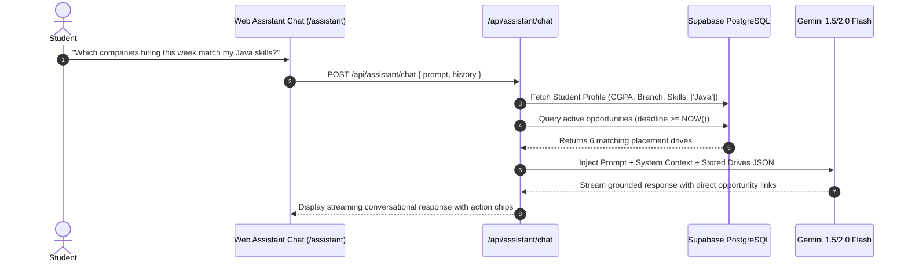

# PlaceMint AI — Future Roadmap & Advanced Intelligence Architecture

> **Phase 2 & Phase 3 Advanced Capabilities**  
> *Conversational RAG placement assistant, pgvector semantic search, institutional analytics, and interview preparation copilots.*

---

## 1. Advanced Architecture Overview (Phases 2 & 3)

```
┌────────────────────────────────────────────────────────────────────────────────────────┐
│                               ADVANCED INTELLIGENCE TIER                               │
│                                                                                        │
│   ┌───────────────────────────┐                     ┌───────────────────────────┐      │
│   │  Grounded Placement Chat  │                     │  Semantic Search Engine   │      │
│   │  - Conversational RAG     │                     │  - pgvector Embeddings    │      │
│   │  - Context-Aware Memory   │                     │  - Cosine Skill Match     │      │
│   └─────────────┬─────────────┘                     └─────────────┬─────────────┘      │
│                 │                                                 │                    │
│                 ▼                                                 ▼                    │
│   ┌───────────────────────────┐                     ┌───────────────────────────┐      │
│   │  Placement Prep Copilot   │                     │  Placement Analytics Hub  │      │
│   │  - Company Syllabus Gen   │                     │  - Conversion Funnel      │      │
│   │  - Past Coding Questions  │                     │  - Branch-wise CTC Heatmap│      │
│   └───────────────────────────┘                     └───────────────────────────┘      │
└────────────────────────────────────────────────────────────────────────────────────────┘
```

---

## 2. Grounded AI Placement Chat Assistant (Phase 3)

### 2.1 Retrieval-Augmented Generation (RAG) Flow
The assistant is designed to answer real student queries (e.g., *"What deadlines do I have this Friday?"*, *"Which companies am I eligible for with 7.8 CGPA?"*) without hallucinations.



---

## 3. Semantic Search & Matching with `pgvector`

### 3.1 Vector Database Schema Addition
```sql
-- Enable vector extension in Supabase
CREATE EXTENSION IF NOT EXISTS vector;

-- Add embedding vector column to opportunities table
ALTER TABLE opportunities ADD COLUMN IF NOT EXISTS description_embedding vector(768);

-- Create HNSW index for fast approximate nearest neighbor search
CREATE INDEX IF NOT EXISTS idx_opportunities_embedding ON opportunities 
USING hnsw (description_embedding vector_cosine_ops);
```

### 3.2 Skill-to-Drive Semantic Similarity Function
```sql
CREATE OR REPLACE FUNCTION match_opportunities_for_student(
    query_embedding vector(768),
    match_threshold float,
    match_count int
)
RETURNS TABLE (
    id UUID,
    company_name TEXT,
    role TEXT,
    similarity float
)
LANGUAGE plpgsql
AS $$
BEGIN
    RETURN QUERY
    SELECT
        o.id,
        o.company_name,
        o.role,
        1 - (o.description_embedding <=> query_embedding) AS similarity
    FROM opportunities o
    WHERE 1 - (o.description_embedding <=> query_embedding) > match_threshold
    ORDER BY similarity DESC
    LIMIT match_count;
END;
$$;
```

---

## 4. Interview Preparation Copilot

When an application transitions to the `ASSESSMENT` or `INTERVIEW` stage:
1. **Topic Generation**: The AI analyzes the company profile and role title to generate a targeted study checklist (e.g., Goldman Sachs $\to$ *Probability, Graph Algorithms, Dynamic Programming, System Design*).
2. **Mock Assessment Questions**: Pre-populates 5 practice coding/analytical questions with solution hints.
3. **Assessment Countdown**: Pins a prominent test clock on the student's dashboard.

---

## 5. Multi-Channel Notification Expansion

| Channel | Trigger Offset | Target Platform |
| :--- | :--- | :--- |
| **Web Push (PWA)** | $T-24\text{h}, T-6\text{h}, T-1\text{h}$ | Desktop & Mobile PWA Service Worker |
| **Daily Telegram Digest** | Every morning at 8:00 AM | Direct message via PlaceMint Telegram Bot |
| **Email Summary** | Sunday 7:00 PM | Consolidated weekly digest of drives & deadlines |
| **WhatsApp Alerts** | Critical ($< 2\text{h}$) | Opt-in WhatsApp Business API notification |
