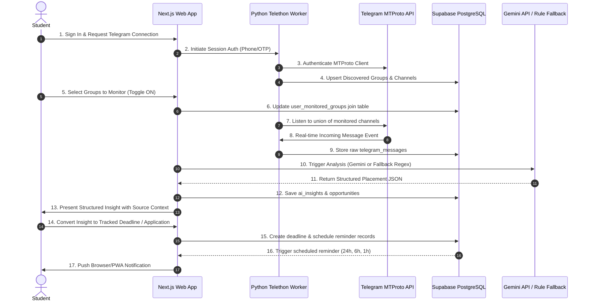

# PlaceMint AI — Master Project Overview

> **AI-Powered Placement Intelligence Assistant**  
> *Transforming chaotic Telegram placement channels into structured, actionable opportunities, deadlines, and smart alerts.*

---

## 1. Executive Summary

**PlaceMint AI** is a specialized placement intelligence platform engineered for college students and fresh graduates. In modern collegiate environments, placement cells, training offices, and peer groups communicate crucial recruitment drives, eligibility criteria, assessment links, and deadlines through **Telegram groups and channels**. 

Students routinely miss life-changing opportunities because:
1. High message volume buries critical notices under casual chat, forwarded links, and duplicate messages.
2. Complex eligibility criteria (e.g., minimum CGPA, specific branch cuts, backlog policies) are embedded in unstructured paragraph text or PDF announcements.
3. Registration deadlines and test slots have tight time windows (often 6 to 24 hours), leading to missed deadlines.

**PlaceMint AI** solves this by establishing an automated pipeline:
$$\text{Telegram Message Ingestion} \longrightarrow \text{Noise Filtering \& Deduplication} \longrightarrow \text{AI / Deterministic Rule Extraction} \longrightarrow \text{Structured Insights} \longrightarrow \text{Eligibility Verification} \longrightarrow \text{Deadline \& Application Tracking} \longrightarrow \text{Multi-Channel Alerts}$$

---

## 2. Core Value Proposition & Differentiators

| Standard Job Tracker | Generic Job Board | PlaceMint AI |
| :--- | :--- | :--- |
| **Data Ingestion** | Manual copy-pasting by student | Scraped public job posts (often stale) | **Automated ingestion from authenticated student Telegram groups** |
| **Context** | Generic enterprise roles | Public market openings | **Campus-specific drives, pool campus assessments, batch-specific notices** |
| **Parsing** | No parsing (raw text notes) | Standardized company fields | **Dual-engine (Gemini AI + Smart Rule Fallback) extraction of campus criteria** |
| **Eligibility** | Student manually checks | Generic boolean filters | **Automated deterministic rule evaluation against student profile** |
| **Workflow** | Basic static status dropdown | Redirect to external application | **End-to-End lifecycle (Saved $\to$ Applied $\to$ Assessment $\to$ Interview $\to$ Offer) + Escalating Reminders** |

---

## 3. High-Level System Architecture

PlaceMint AI is designed as a resilient, modular system composed of three core tiers:

```
+----------------------------------------------------------------------------------------------------+
|                                      STUDENT CLIENT (Browser / PWA)                                |
|   - Dashboard (Urgent Deadlines, New Insights, Eligibility Alerts)                                 |
|   - Telegram Group Discovery & Monitoring Management                                               |
|   - Placement Insights Feed & Opportunity Explorer                                                 |
|   - Deadline Calendar & Kanban Application Tracker                                                 |
|   - In-App & Browser Push Notifications                                                            |
+-------------------------------------------------+--------------------------------------------------+
                                                  | HTTPS / WSS
                                                  v
+----------------------------------------------------------------------------------------------------+
|                                 NEXT.JS APPLICATION LAYER (Vercel)                                 |
|   - Next.js App Router (Server Actions & Route Handlers)                                           |
|   - Authentication & Session Verification (Supabase Auth / JWT)                                    |
|   - Placement Insight Processing & Gemini 1.5 / 2.0 AI Extraction Engine                           |
|   - Deterministic Rule Fallback Parser (Regex / NLP Pattern Matching)                              |
|   - Deterministic Student Eligibility Engine                                                       |
|   - Deadline & Reminder Scheduling Engine                                                          |
+------------------------+---------------------------------------------------+-----------------------+
                         | Service Role / RLS                                | Shared Secret Webhook
                         v                                                   v
+----------------------------------------------------+   +-------------------------------------------+
|             SUPABASE POSTGRESQL TIER               |   |       PYTHON TELEGRAM WORKER (Render)     |
|   - Student Profiles & Auth Data                   |   |   - Telethon MTProto Client               |
|   - Discovered Groups & Multi-User Monitoring Join |   |   - QR / Phone OTP Auth Flow              |
|   - Ingested Raw Telegram Messages                 |   |   - Dynamic Group Discovery Engine        |
|   - Extracted Structured Opportunities & Insights  |   |   - Union-based Monitored Channel Listener|
|   - Deadlines, Reminders & Notification Outbox     |   |   - Message Ingestion & Webhook Dispatch  |
|   - Row-Level Security (RLS) & Triggers            |   |   - Automated Historical Backfill Engine  |
+----------------------------------------------------+   +-------------------------------------------+
```

---

## 4. End-to-End Data Pipeline



---

## 5. Key System Capabilities

### 5.1 Telegram Account & Group Discovery
- Connects securely using MTProto via Telethon.
- Automatically discovers all joined channels, supergroups, and discussion groups.
- Allows students to cherry-pick which groups to actively monitor.
- Computes the union of monitored groups across all platform students to minimize worker overhead and avoid duplicate network ingestion.

### 5.2 Dual-Engine Extraction (Gemini + Deterministic Fallback)
- **Primary AI Provider**: Google Gemini API parses unstructured conversational announcements into normalized schema (Company, Role, CTC/Stipend, Eligibility, Registration Deadline, Test Date, Application URL).
- **Fallback Engine**: If the Gemini API is rate-limited, offline, or unconfigured, an extensive regex and rule-based parser extracts critical dates, URLs, company names, and batch years deterministically.
- **Source Context Preservation**: Every insight maintains a direct pointer to the original raw message text and Telegram message ID, enabling instant student verification.

### 5.3 Deterministic Eligibility Engine
- Compares structured placement requirements against student profile parameters:
  - Graduation Batch / Year
  - Degree & Branch / Specialization
  - Cumulative Grade Point Average (CGPA) / Percentage
  - Maximum Allowed Active / Historical Backlogs
  - Required Skills / Pre-requisites
- Emits explicit status (`ELIGIBLE`, `NOT_ELIGIBLE`, `NEEDS_REVIEW`) along with transparent, human-readable justification reasons.

### 5.4 Deadline & Escalation Engine
- Tracks application close times, online assessment windows, and interview slots.
- Multi-tier reminder notifications scheduled at $T-24\text{ hours}$, $T-6\text{ hours}$, and $T-1\text{ hour}$.
- Urgency escalation dynamically updates status to `URGENT` within 12 hours of closing, and flags `OVERDUE` post-deadline.

---

## 6. Phased Evolution Roadmap

1. **Phase 1 — Core MVP Pipeline**: End-to-end flow from Telegram connection and group monitoring to raw message storage in Supabase, Gemini/Fallback analysis, structured insights, deadline creation, and browser notifications.
2. **Phase 2 — Placement Intelligence Expansion**: Student profile management, deterministic eligibility evaluator, company tracking directory, Kanban application tracking lifecycle, smart search, and duplicate message grouping.
3. **Phase 3 — Advanced Intelligence**: Grounded AI Placement Assistant (Q&A grounded in stored student notices), placement analytics, interview preparation suggestions, and `pgvector` semantic matching for job profiles.

---

## 7. Master Documentation Index

| Document | Purpose |
| :--- | :--- |
| [project-overview.md](file:///c:/Users/wwa90/OneDrive/Desktop/placement-ai/docs/project-overview.md) | High-level vision, problem statement, architecture, and core data flow. |
| [structure.md](file:///c:/Users/wwa90/OneDrive/Desktop/placement-ai/docs/structure.md) | Repository directory structure, module boundaries, and service architecture. |
| [database.md](file:///c:/Users/wwa90/OneDrive/Desktop/placement-ai/docs/database.md) | Supabase PostgreSQL schema, relational tables, indexes, triggers, and RLS policies. |
| [design.md](file:///c:/Users/wwa90/OneDrive/Desktop/placement-ai/docs/design.md) | UI/UX design system, color palette, screen wireframes, and component hierarchy. |
| [business-rules.md](file:///c:/Users/wwa90/OneDrive/Desktop/placement-ai/docs/business-rules.md) | Business logic, deterministic eligibility criteria, reminder offsets, and status transitions. |
| [ai-pipeline.md](file:///c:/Users/wwa90/OneDrive/Desktop/placement-ai/docs/ai-pipeline.md) | Gemini AI extraction prompt schemas, fallback rule engine, and grounding safeguards. |
| [telegram.md](file:///c:/Users/wwa90/OneDrive/Desktop/placement-ai/docs/telegram.md) | Telethon worker design, MTProto session security, group sync, and ingestion loop. |
| [api.md](file:///c:/Users/wwa90/OneDrive/Desktop/placement-ai/docs/api.md) | API route specifications, request/response models, auth headers, and error codes. |
| [security.md](file:///c:/Users/wwa90/OneDrive/Desktop/placement-ai/docs/security.md) | Security threat model, RLS enforcement, session string encryption, and data privacy. |
| [testing.md](file:///c:/Users/wwa90/OneDrive/Desktop/placement-ai/docs/testing.md) | Comprehensive test strategy: Unit, integration, E2E, security, and fallback test plans. |
| [deployment.md](file:///c:/Users/wwa90/OneDrive/Desktop/placement-ai/docs/deployment.md) | Deployment runbook for Vercel, Render, and Supabase, including environment variables. |
| [phases.md](file:///c:/Users/wwa90/OneDrive/Desktop/placement-ai/docs/phases.md) | Step-by-step development phases with acceptance criteria and tasks. |
| [implementation.md](file:///c:/Users/wwa90/OneDrive/Desktop/placement-ai/docs/implementation.md) | Engineering blueprint, execution roadmap, and code assembly steps. |
| [future-roadmap.md](file:///c:/Users/wwa90/OneDrive/Desktop/placement-ai/docs/future-roadmap.md) | Deep-dive architectural plans for Phase 2 and Phase 3 capabilities. |
