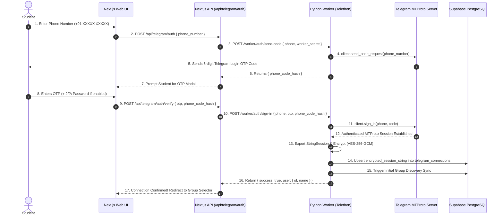

# PlaceMint AI — Telegram Integration & Telethon Worker Specification

> **Telegram Ingestion & Synchronization Engine**  
> *Python 3.11 + Telethon MTProto client architecture, session security, multi-user channel union monitoring, and real-time ingestion.*

---

## 1. Telegram Worker Architecture Overview

To circumvent browser limitations and maintain persistent real-time socket connections with Telegram's MTProto servers, PlaceMint AI offloads Telegram operations to a standalone **Python Telethon Worker** hosted on Render.

```
+-----------------------------------------------------------------------------------------+
|                                PYTHON TELETHON WORKER                                   |
|                                                                                         |
|   ┌─────────────────────────────────────────────────────────────────────────────────┐   |
|   │                        Telethon MTProto Client Pool                             │   |
|   │   - StringSession Loader (Decrypted from Supabase)                              │   |
|   │   - Auto-reconnection, Keep-alive & FloodWait backoff handlers                  │   |
|   └────────────────────────────────────────┬────────────────────────────────────────┘   |
|                                            │                                            |
|                    ┌───────────────────────┴───────────────────────┐                    |
|                    ▼                                               ▼                    |
|       ┌────────────────────────┐                     ┌────────────────────────┐         |
|       │  Dynamic Group Finder  │                     │  Union Event Listener  │         |
|       │  (GetDialogs Engine)   │                     │  (@events.NewMessage)  │         |
|       └────────────┬───────────┘                     └────────────┬───────────┘         |
|                    │                                              │                     |
|                    ▼                                              ▼                     |
|       ┌────────────────────────┐                     ┌────────────────────────┐         |
|       │  Supabase Groups Sync  │                     │ Message Ingest Engine  │         |
|       │  (Upsert telegram_     │                     │ (SHA-256 Hash + Store  │         |
|       │   groups)              │                     │ in telegram_messages)  │         |
|       └────────────────────────┘                     └────────────┬───────────┘         |
|                                                                   │                     |
|                                                                   ▼                     |
|                                                      ┌────────────────────────┐         |
|                                                      │ Next.js Webhook Notify │         |
|                                                      │ (Trigger Auto-Insight) │         |
|                                                      └────────────────────────┘         |
+-----------------------------------------------------------------------------------------+
```

---

## 2. Authentication & Session Security Flow

### 2.1 Student Telegram Connection Flow



---

## 3. Dynamic Group Discovery & Sync Engine

When a student connects or clicks **"Sync All Groups"**, the worker executes:

```python
async def discover_and_sync_groups(client: TelegramClient, user_id: str):
    """
    Iterates through all dialogs (channels, supergroups, broadcast channels)
    and synchronizes them into Supabase PostgreSQL.
    """
    dialogs = await client.get_dialogs()
    discovered_groups = []

    for dialog in dialogs:
        if dialog.is_channel or dialog.is_group:
            entity = dialog.entity
            chat_type = 'CHANNEL' if dialog.is_channel and not getattr(entity, 'megagroup', False) else 'SUPERGROUP'
            
            group_data = {
                "telegram_id": dialog.id,
                "title": dialog.name,
                "username": getattr(entity, 'username', None),
                "chat_type": chat_type,
                "total_members": getattr(entity, 'participants_count', None),
                "last_message_at": dialog.date.isoformat() if dialog.date else None,
                "last_discovered_at": datetime.utcnow().isoformat()
            }
            discovered_groups.append(group_data)

    # Upsert discovered groups into Supabase
    supabase.table("telegram_groups").upsert(discovered_groups, on_conflict="telegram_id").execute()
    
    # Associate groups with the user in user_monitored_groups (default unmonitored until toggled)
    for group in discovered_groups:
        db_group = supabase.table("telegram_groups").select("id").eq("telegram_id", group["telegram_id"]).single().execute()
        if db_group.data:
            supabase.table("user_monitored_groups").upsert({
                "user_id": user_id,
                "group_id": db_group.data["id"],
                "is_monitored": False
            }, on_conflict="user_id,group_id").execute()
```

---

## 4. Multi-User Union Channel Listener

To scale across hundreds of students without spawning duplicate socket listeners for the same university placement channel, the worker computes the **Union of Active Monitored Groups**:

$$\mathcal{G}_{\text{active}} = \bigcup_{u \in \text{Users}} \left\{ g \in \text{Groups} \mid \text{is\_monitored}(u, g) = \text{true} \right\}$$

```python
@client.on(events.NewMessage(chats=get_monitored_group_ids()))
async def handle_incoming_placement_message(event):
    """
    Listens exclusively to the union of active monitored channels.
    Ingests message, computes SHA-256 hash, and saves to database.
    """
    message = event.message
    group_tg_id = event.chat_id
    raw_text = message.text or ""

    if len(raw_text.strip()) < 10:
        return  # Filter out trivial noise

    # Compute SHA-256 hash for deduplication
    message_hash = hashlib.sha256(raw_text.strip().lower().encode('utf-8')).hexdigest()

    # Query internal group UUID
    group_row = supabase.table("telegram_groups").select("id").eq("telegram_id", group_tg_id).single().execute()
    if not group_row.data:
        return

    # Ingest message
    msg_insert = supabase.table("telegram_messages").upsert({
        "group_id": group_row.data["id"],
        "telegram_message_id": message.id,
        "sender_id": message.sender_id,
        "sender_name": getattr(message.sender, 'first_name', 'Unknown'),
        "message_text": raw_text,
        "message_timestamp": message.date.isoformat(),
        "message_hash": message_hash,
        "has_links": bool("http" in raw_text)
    }, on_conflict="group_id,telegram_message_id").execute()

    # Notify Webhook for real-time AI processing
    notify_web_app_of_new_message(msg_insert.data[0]["id"])
```

---

## 5. Resiliency, Rate Limits & Reconnection Handling

1. **FloodWait Handling**: Telethon raises `FloodWaitError(seconds)`. The worker catches this exception, logs the backoff window, sleeps asynchronously, and resumes without crashing.
2. **GramJS / Session Sync Invalidation**: If the worker loses session state on container restart, it invokes `/api/worker-webhook/sync-session` to fetch the latest encrypted session string and re-initialize.
3. **Heartbeat Healthcheck**: The worker exposes an HTTP endpoint `GET /health` responding with `{ "status": "healthy", "connected": true, "monitored_groups_count": N }` every 30 seconds to prevent Render spin-down.
